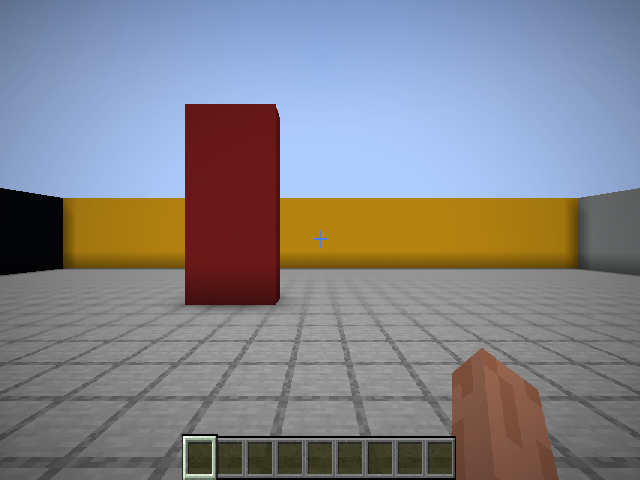
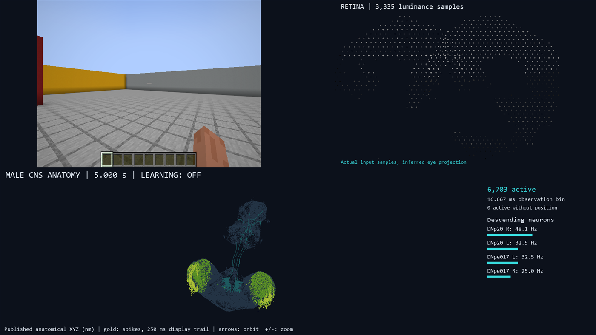

# Getting started

A short, low-jargon path from a fresh clone to running the three main modes.
If you only read one page, read this one. The detailed references are linked at
the bottom.

---

## 1. Prerequisites

- **Windows 10/11** (the project is Windows-only: local JDK/LLVM toolchain and
  CraftGround window handling).
- **PowerShell**.
- **Git** on `PATH` (setup clones the pinned upstream repos).
- **Any Python 3** on `PATH`. It is used only to bootstrap `uv`; setup installs
  its own Python 3.11 into the project.
- **Internet access** for the first setup (toolchain, connectome data, Minecraft
  runtime).
- **Several GB of free disk space** (local Python, JDK 21, LLVM, Gradle,
  CraftGround/Minecraft and connectome data).
- No system Java or CUDA needed — everything is project-local.

Everything installs **inside the project folder** (`.tools/`, `.venv/`,
`vendor/`), so nothing global is modified.

---

## 2. Install (once)

From the project root:

```powershell
# Allow local scripts for this terminal only (if Windows blocks them)
Set-ExecutionPolicy -Scope Process -ExecutionPolicy Bypass

# One-time setup: downloads tools, builds the native kernel and Minecraft runtime
.\setup.ps1
```

This is the long step (downloads + native builds). It ends by building the
neural kernel and the anatomical geometry.

On a later repeat setup you can skip the slow full connectome data audit:

```powershell
.\setup.ps1 -SkipDataAudit
```

---

## 3. Check it works

```powershell
.\test.ps1
```

This runs the neural reference, the full-connectome test, a live CraftGround
test and a short baseline. If it prints success, you're ready.

Neural-only check without launching Minecraft:

```powershell
.\test.ps1 -NeuralOnly
```

---

## 4. Run the main modes

All commands run from the project root. Press `Ctrl+C` to stop cleanly.



*The fly's 640x480 Minecraft view — here the frozen baseline's red-concrete
target pillar in the test arena.*

### A. Frozen fly — nothing learns

```powershell
.\run-baseline.ps1              # run until Ctrl+C
.\run-baseline.ps1 -Steps 1200  # ~60 simulated seconds
```



*The frozen-baseline dashboard (`-RecordVisuals` writes this as video).*

### B. Let the fly's own synapses learn

```powershell
# Start a new training run
.\train.ps1 -Mode Fresh -Steps 100000 -CheckpointEvery 10000 -NoPreview

# Continue where it left off
.\train.ps1 -Mode Resume -Checkpoint latest -Steps 50000 -NoPreview

# Test a checkpoint without learning
.\train.ps1 -Mode Evaluate -Checkpoint latest -Episodes 20 -NoPreview
```

### C. Freeze the fly, train an ML readout to interpret it

```powershell
.\train-readout.ps1 -Mode Fresh -Steps 10000 -Config config/new-arch.json
```

### Watch a recording afterwards

```powershell
.\play-activity.ps1 ".\artifacts\training\run-...\episode-000020-step-000011691"
```

---

## 5. Where things go

- Training output: `artifacts\training\run-<timestamp>\`
- Readout output: `artifacts\readout-training\run-<timestamp>\`
- Baseline output: `artifacts\baseline-<timestamp>\`
- `artifacts\` is generated and git-ignored.

To stop, use `Ctrl+C` (it saves a final checkpoint). Avoid force-killing the
terminal, especially while recording.

---

## 6. Go deeper

- How it all works: [architecture.md](architecture.md)
- Every switch and mode: [running-modes.md](running-modes.md)
- Install/build details: [setup.md](setup.md)
- All config fields: [configuration.md](configuration.md)
- Outputs and checkpoints: [checkpoints-and-artifacts.md](checkpoints-and-artifacts.md)
- Something broke: [troubleshooting.md](troubleshooting.md)
