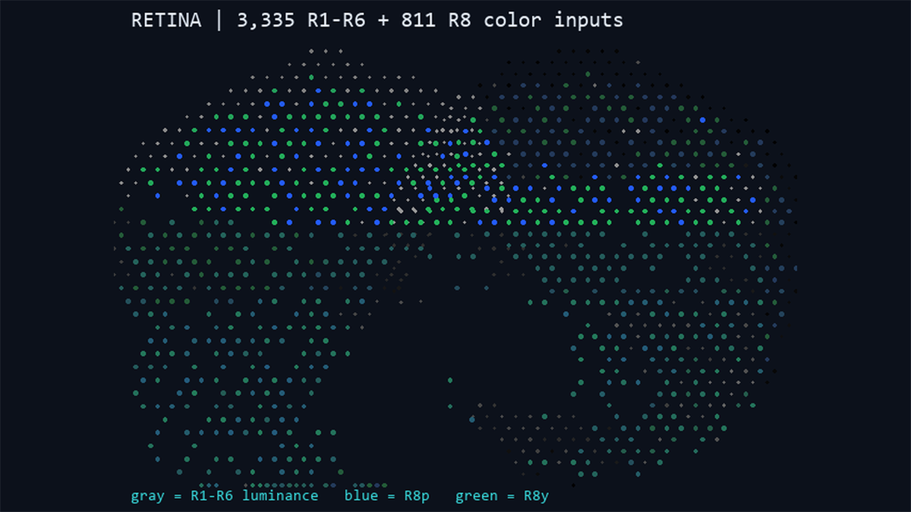
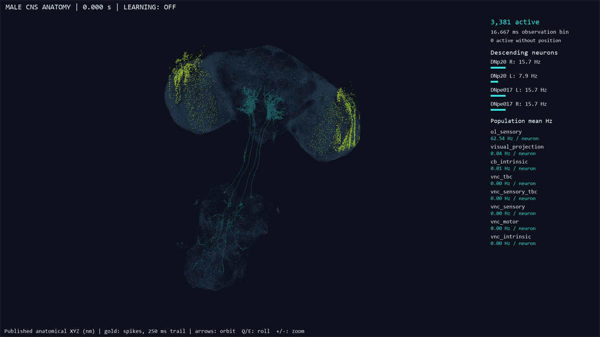
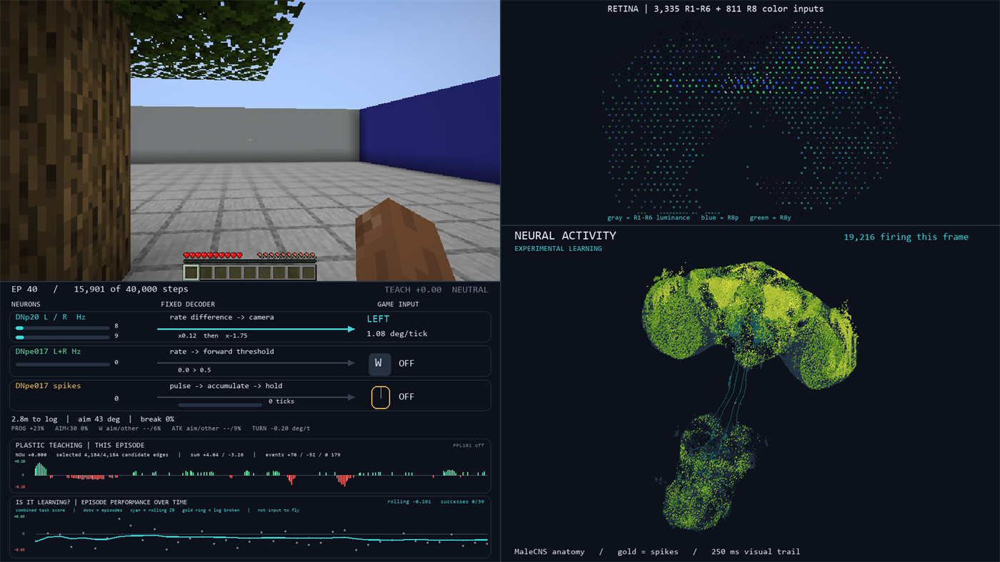
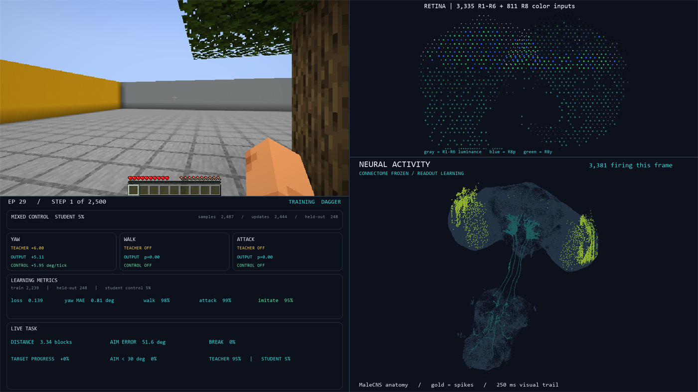

# Running modes

Every entry point is a PowerShell wrapper (`.ps1`) around a `python -m
flycraft.*` module or a `scripts/*.py` tool. Run everything from the project
root. All wrappers first load `env.ps1`, which puts the project-local Python,
JDK, LLVM toolchain and `PYTHONPATH` into the current process.

If PowerShell blocks local scripts:

```powershell
Set-ExecutionPolicy -Scope Process -ExecutionPolicy Bypass
```

---

## 1. Setup and verification

| Command | What it does |
|---|---|
| `.\setup.ps1` | Full one-time toolchain/data/native setup. See [setup.md](setup.md). |
| `.\setup.ps1 -SkipDataAudit` | Skip the long full connectome data audit on a repeat setup. |
| `.\test.ps1` | Neural numerical reference + full-connectome test + live CraftGround test + a 300-tick baseline. |
| `.\test.ps1 -NeuralOnly` | The neural checks only, no Minecraft. |

`test.ps1` verifies the **original frozen model**, not a learned checkpoint.

---

## 2. Frozen baseline — `run-baseline.ps1`

Runs the original fixed-weight fly against live Minecraft. Learning is off and
the weight hash is verified before and after.


*The frozen-baseline dashboard: game view, retina, anatomical activity and
descending-neuron readouts, with `LEARNING: OFF`.*

```powershell
.\run-baseline.ps1                 # run until Ctrl+C
.\run-baseline.ps1 -Steps 1200     # stop after N control ticks
```

At 20 control ticks per simulated second:

```text
  200 steps =  10 simulated seconds
1,200 steps =  60 simulated seconds
6,000 steps =   5 simulated minutes
```

`-Steps 0` means run until stopped.

### `run-baseline.ps1` switches

| Switch | Meaning |
|---|---|
| `-Steps <N>` | Number of control ticks; `0` runs until Ctrl+C. |
| `-Record` | Write the Minecraft RGB `baseline.mp4` (1080p60). |
| `-RecordVisuals` | Full dashboard + retina + neural-activity videos; also enables activity and trajectory recording. |
| `-RecordActivity` | Raw sparse 60 Hz spikes and quantized 20 Hz voltage, without dashboard video. |
| `-RecordTrajectory` | Exact 20 Hz pose/action trace only. |
| `-NoPreview` | Do not open the interactive preview window. |
| `-Debug` | Save periodic RGB/retina/debug snapshots. |
| `-Playback <folder>` | Replay a recorded baseline folder instead of running Minecraft. |
| `-ActivityMode Spikes\|Voltage\|Combined` | Neural display mode (default `Spikes`). |
| `-VoltageSmoothingMs <N>` | Display-only voltage smoothing; `0` disables (default 80). |

Any video/activity recording automatically preserves the Minecraft trajectory.

### Neural display modes

```powershell
.\run-baseline.ps1 -ActivityMode Spikes
.\run-baseline.ps1 -ActivityMode Voltage
.\run-baseline.ps1 -ActivityMode Combined -VoltageSmoothingMs 80
```



*The retina view. In learning mode it shows R1-R6 luminance (gray/white) plus the
inferred R8p (blue) and R8y (green) colour inputs.*



*The anatomical neural-activity view: MaleCNS positions, gold spike trail, and
live population/descending-neuron rates.*

Voltage smoothing is visual only; it never alters the simulation.

### Dashboard keyboard controls (live viewer)

```text
1        Minecraft/game view
2        Retina
3        Neural activity
4        Full dashboard
Arrows   Orbit neural anatomy
Q / E    Roll neural anatomy
+ / -    Zoom
Space    Pause visual display
Esc      Stop
```

---

## 3. Baseline evaluation — `evaluate-baseline.ps1`

```powershell
.\evaluate-baseline.ps1                    # 300 ticks + closed-loop evidence check
.\evaluate-baseline.ps1 -Steps 1000
.\evaluate-baseline.ps1 -Steps 1000 -Record
```

It runs `run-baseline.ps1 -Debug`, then (for ≥100 steps) `scripts/verify_baseline.py`,
which audits action mapping, movement, attack, RGB→retina hashes and unchanged
weights, and writes `verification.json` into the run folder.

---

## 4. Signed reinforcement training — `train.ps1`

Five modes:

```text
Fresh     = original untrained fly → new training timeline
Resume    = latest checkpoint      → continue the SAME timeline
Branch    = chosen checkpoint      → create a NEW timeline
Evaluate  = chosen checkpoint      → frozen tests, no learning
Replay    = chosen checkpoint      → frozen tests + recorded footage
```



*The signed-reinforcement training dashboard: Minecraft view, retina, neural
activity, the decoder readouts, the per-tick `PLASTIC TEACHING` signal, and the
`IS IT LEARNING? | EPISODE PERFORMANCE OVER TIME` learning curve.*

`train.ps1` automatically runs `scripts/prepare_training_runtime.py` before
launching so CraftGround exposes genuine block-breaking telemetry.

### `train.ps1` parameters

| Option | Meaning |
|---|---|
| `-Mode Fresh\|Resume\|Branch\|Evaluate\|Replay` | Mode (default `Fresh`). |
| `-Checkpoint <path-or-latest>` | Checkpoint/run/pointer to load (default `latest`). |
| `-Config <json>` | Alternate training config (default `training.json`). |
| `-Steps <N>` | Fresh: number of training steps. Resume/Branch: **additional** steps. |
| `-CheckpointEvery <N>` | Override `checkpoint_every_steps` for this invocation. |
| `-Episodes <N>` | Override `evaluation_episodes` (mainly Evaluate/Replay). |
| `-ActivityMode Spikes\|Voltage\|Combined` | Neural display mode. |
| `-VoltageSmoothingMs <N>` | Display-only voltage smoothing. |
| `-NoPreview` | Do not open the interactive dashboard window. |

If `-Steps` is omitted for Fresh, the value comes from
`training.total_steps` in the config.

### Fresh — start from scratch

```powershell
.\train.ps1 -Mode Fresh -Steps 100000 -CheckpointEvery 10000 -NoPreview
```

Always creates a new `artifacts\training\run-...` directory and starts from the
original untrained model. Previous runs are untouched.

### Resume — continue the same run

```powershell
.\train.ps1 -Mode Resume -Checkpoint latest -Steps 50000 -NoPreview
```

`-Steps` is **additional**. If the checkpoint is at 43,817 and you pass 50,000,
the target is 93,817. Resume only accepts the latest generation of a run; use
Branch for older checkpoints. You may also point at a run directory, which
resolves to its own `checkpoints\latest.json`.

### Branch — fork from an older checkpoint

```powershell
.\train.ps1 -Mode Branch `
  -Checkpoint ".\artifacts\training\run-...\checkpoints\step-000030000" `
  -Steps 70000 -NoPreview
```

Loads the chosen learned brain but creates a brand-new run directory and writes
`branch.json` with the parent checkpoint. The branch's `checkpoints\baseline\`
is the **branch starting state**, not the virgin fly. Branching is the
recommended way to compare changed reward/plasticity/config settings from the
same learned state.

### Evaluate — frozen test, no learning

```powershell
.\train.ps1 -Mode Evaluate -Checkpoint latest -Episodes 20 -NoPreview
```

Restores the checkpoint into a separate fly, freezes plasticity/traces, runs
randomized held-out starts, verifies the frozen weights did not change, and
writes `evaluation.json` under a new `artifacts\training\evaluate-...` folder.

Useful checkpoint targets: a numbered checkpoint directory, a run directory, or
a pointer JSON (`latest.json`, `best.json`, or the global `latest`).

### Replay — evaluate and record footage

```powershell
.\train.ps1 -Mode Replay -Checkpoint latest -Episodes 1
```

A frozen evaluation with recording enabled. A good comparison workflow is to
replay the same progression of checkpoints (baseline, 10k, 25k, 50k, 75k, 100k).

### Mid-episode checkpoints

Periodic checkpoints can land mid-episode. The neural/plastic state is saved
exactly, but the Minecraft world is not. On resume/branch from such a state,
FlyCraft restarts the episode and records the unfinished partial episode as
`censored: true` rather than pretending it completed.

### Viewing learning over time

There is **no separate plotting script**. The learning-over-time graph is a panel
of the dashboard itself: `IS IT LEARNING? | EPISODE PERFORMANCE OVER TIME`.

- each dot is one completed episode's combined task score (its reward total);
- the cyan line is the rolling average over
  `dashboard.reward_rolling_average_episodes`;
- a gold ring marks episodes that broke the log.

It is evaluation telemetry only — it is never fed back to the fly. The per-tick
teaching signal is a separate panel, `PLASTIC TEACHING | THIS EPISODE`, which
shows what was actually injected into plasticity.

Where to see it:

- **Live** during `train.ps1`, and inside the recorded `dashboard.mp4` files.
- **Offline** by replaying a recorded episode folder with the existing renderer,
  which re-reads `reward-history.json` and `steps-*.jsonl.gz` and redraws the
  curve:

  ```powershell
  .\run-baseline.ps1 -Playback ".\artifacts\training\run-...\episode-000040-step-000015600" -Steps 1 -NoPreview
  # writes ...\playback-proof\dashboard-preview.png
  ```

The raw numbers are in `reward-history.json` (per episode) and
`metrics-<timestamp>.jsonl` (per tick); see
[checkpoints-and-artifacts.md](checkpoints-and-artifacts.md).

---

## 5. Frozen-connectome supervised readout — `train-readout.ps1`

A separate learning path that never changes a fly synapse. It trains a small
motor readout on simulated neural spike features using a scripted expert's
labels, then lets the student act autonomously. See
[readout-learning.md](readout-learning.md) for the full pipeline.



*The supervised-readout dashboard during DAgger: teacher/student control share,
the student's yaw/walk/attack, held-out imitation metrics, and the live task
progress. Note the R8 colour retina.*

```powershell
.\train-readout.ps1 -Mode Fresh    -Steps 10000 -Config config/new-arch.json
.\train-readout.ps1 -Mode Resume   -Checkpoint latest -Steps 5000 -Config config/new-arch.json
.\train-readout.ps1 -Mode Evaluate -Checkpoint latest -Episodes 20 -Config config/new-arch.json
.\train-readout.ps1 -Mode Replay   -Checkpoint latest -Episodes 3 -Config config/new-arch.json
```

| Option | Meaning |
|---|---|
| `-Mode Fresh\|Resume\|Evaluate\|Replay` | Mode (default `Fresh`). |
| `-Checkpoint <path-or-latest>` | Readout checkpoint (`readout-latest.npz`) or a pointer. |
| `-Config <json>` | Config (default `config/new-arch.json`). |
| `-Steps <N>` | Fresh: steps. Resume: additional steps. |
| `-Episodes <N>` | Episodes for Evaluate/Replay. |
| `-NoPreview` | Do not open the dashboard window. |

Artifacts go to `artifacts\readout-training\run-...\`; the learned object is
`readout-latest.npz`. The full connectome is rebuilt from the fixed config and
is never checkpointed as learned state.

---

## 6. Offline neural-activity playback — `play-activity.ps1`

Plays a recording that contains `activity-60hz.jsonl.gz` (and optionally
`voltage-20hz/`). Never runs Minecraft or the simulation.

```powershell
.\play-activity.ps1 ".\artifacts\...\episode-000020-step-000011691"
.\play-activity.ps1 ".\artifacts\...\activity-60hz.jsonl.gz" -ActivityMode Combined -VoltageSmoothingMs 80
```

Controls:

```text
Space              Play/pause
Click/drag timeline Seek
Left/Right          ±1 second
Shift+Left/Right    ±5 seconds
, / .               Previous/next frame
[ / ]               Playback speed
Mouse left-drag     Rotate anatomy
Mouse right-drag    Roll anatomy
Mouse wheel         Zoom
W/A/S/D             Pitch/yaw anatomy
Q/E                 Roll anatomy
1 / 2 / 3           Spikes / Voltage / Combined
R                   Reset camera
Home/End            Start/end
Esc                 Close
```

The first use builds a disk-backed seek cache in `.activity-player-cache` beside
the recording. Older recordings without voltage data fall back to spikes only.

The baseline runner also has a simpler playback path via
`.\run-baseline.ps1 -Playback <folder>`.

---

## 7. Explainer animation — `run-learning-visualizer.cmd`

A standalone, wordless YouTube explainer animation (no simulation state). See
[video-and-explainer.md](video-and-explainer.md).

```powershell
.\run-learning-visualizer.cmd
```

---

## 8. Controlled tests

Neural/training infrastructure without a long Minecraft run:

```powershell
. .\env.ps1
& $python scripts\test_training.py
& $python scripts\test_action_credit.py
& $python scripts\test_readout_learning.py
& $python scripts\test_decoder.py
& $python scripts\test_speed_exact.py
```

Short live Minecraft training-infrastructure smoke test:

```powershell
. .\env.ps1
& $python scripts\test_training_live.py
```

These are infrastructure checks, not meaningful long learning experiments.
See [scripts.md](scripts.md) for everything else.

---

## 9. Practical long-run workflow

```text
1.  Run controlled tests.
2.  Run a short 1k–5k training sanity check.
3.  Inspect reward-history, metrics, checkpoints and one recorded episode.
4.  Confirm wall-clock steps/second.
5.  Choose evaluation and recording cadence deliberately (see performance.md).
6.  Start the long Fresh run with -NoPreview.
7.  Let periodic checkpoints protect progress.
8.  If interrupted, Resume latest.
9.  After training, Evaluate selected/best checkpoints with a larger sample.
10. Replay chosen checkpoints to generate clean comparison footage.
```

Example:

```powershell
.\train.ps1 -Mode Fresh -Steps 100000 -CheckpointEvery 10000 -NoPreview
```

Use `Ctrl+C` to stop cleanly: the `finally` path saves a new latest checkpoint
before closing the Minecraft environment. Avoid force-killing the terminal,
especially while recording, because encoders and checkpoint writers need to
finalize cleanly.
